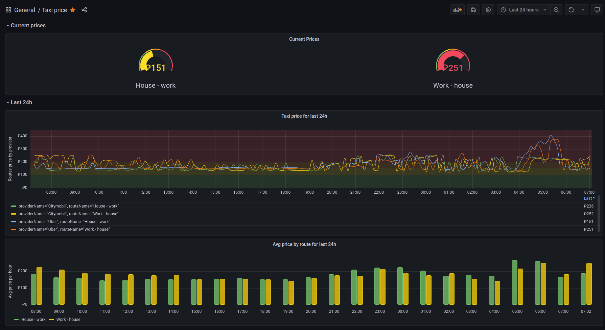

# Taxi route price tracker

[](https://github.com/raccoon1515/Taxi-price/actions/workflows/release.yml)



An application that collects taxi route prices. The following price providers are supported:
* **Uber Russia**,
* **Citymobil**.


## Requirements
Application requires [InfluxDB](https://www.influxdata.com/).

## Run
### Docker-compose
Docker-compose project example available [here](./docker).

### Docker
The latest image version available [here](https://github.com/raccoon1515/Taxi-price-tracker/pkgs/container/tpt).
```bash
$ docker run \
  -e INFLUXDB_URL=http://localhost:8080 \
  -e INFLUXDB_ORG=myorg \
  -e INFLUXDB_BUCKET=mybucket \
  -e INFLUXDB_TOKEN=super-secret-token \
  -e DECRYPT_SECRET=my-decrypt-secret \
  -e DECRYPT_SALT=my-decrypt-salt \
  -v /etc/tpt/routes.json:/etc/taxi-price-tracker/routes.json \
  ghcr.io/raccoon1515/tpt:1.0
```

### Graalvm native image
```bash
$ wget https://github.com/raccoon1515/Taxi-price-tracker/releases/download/v1.0/TaxiPriceTracker-1.0
$ sudo chmod +x ./TaxiPriceTracker-1.0 
$ ./TaxiPriceTracker-1.0
```

### Jar
```bash
$ https://github.com/raccoon1515/Taxi-price-tracker/releases/download/v1.0/TaxiPriceTracker-1.0.jar
$ java -jar TaxiPriceTracker-1.0.jar
```

### Build from source
```bash
$ git clone git@github.com:raccoon1515/Taxi-price-tracker.git
```
To build jar:
```bash
$ ./gradlew build
$ java -jar build/libs/TaxiPriceTracker-1.0.jar
```
To build native image:
```bash
$ ./gradlew nativeCompile
$ build/native/nativeCompile/TaxiPriceTracker
```
please note that to build native image you must have installed [Graalvm](https://www.graalvm.org/) and [native-image](https://www.graalvm.org/22.0/reference-manual/native-image/).
Also, you can build docker-image with Graalvm native image by:
```bash
$ docker build -f native-build/Dockerfile -t ghcr.io/raccoon1515/tpt:1.0 .
```

## Configure environment
The following environment variables are available:  

| **Variable**                     | **Description**                                              | **Default**                         |
|:---------------------------------|:-------------------------------------------------------------|-------------------------------------|
| **INFLUXDB_URL**                 | Influxdb connection URL                                      | http://localhost:8086               |
| **INFLUXDB_ORG**                 | Influxdb organization                                        | raccoon                             |
| **INFLUXDB_BUCKET**              | Influxdb bucket                                              | raccoon                             |
| **INFLUXDB_TOKEN**               | Influxdb secret token                                        | raccoon-very-secret-token           |
| **APP_HTTP_CONNECTION_TIMEOUT**  | HTTP(s) connection timeout to the destination price provider | PT10S                               |
| **APP_HTTP_RESPONSE_TIMEOUT**    | HTTP(s) response timeout from the destination price provider | PT10S                               |
| **APP_HTTP_PROXY_ENABLED**       | Enables proxy                                                | false                               |
| **APP_HTTP_PROXY_HOST**          | Proxy host                                                   | localhost                           |
| **APP_HTTP_PROXY_PORT**          | Proxy port                                                   | 8080                                |
| **APP_HTTP_PROXY_TYPE**          | Proxy type. One of: HTTP, SOCKS, DIRECT                      | HTTP                                |
| **APP_HTTP_PROXY_AUTH_USERNAME** | Proxy auth username                                          | -                                   |
| **APP_HTTP_PROXY_AUTH_PASSWORD** | Proxy auth password                                          | -                                   |
| **APP_RETRIEVE_INTERVAL**        | Price retrieve interval                                      | PT8M                                |
| **ROUTES_PATH**                  | A file system path to the routes configuration file          | /etc/taxi-price-tracker/routes.json |
| **DECRYPT_SECRET**               | Resource decryption secret                                   | raccoon                             |
| **DECRYPT_SALT**                 | Resource decryption salt                                     | raccoon                             |

## Configure tracking routes
Application waiting for a **routes.json** file at _/etc/taxi-price-tracker/_ directory. 
This file is consists of json array of route objects. A routes example file: 
```json
[
  {
    "name": "House — work",
    "start": {
      "latitude": 50.0465230093882,
      "longitude": 80.92797799222171
    },
    "finish": {
      "latitude": 40.0826158713582,
      "longitude": 40.9386886395514
    }
  },
  {
    "name": "Work — house",
    "start": {
      "latitude": 40.0826158713582,
      "longitude": 40.9386886395514
    },
    "finish": {
      "latitude": 50.0465230093882,
      "longitude": 80.92797799222171
    }
  }
]
```
